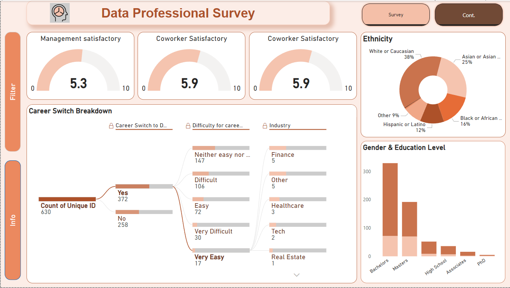

# Data Professional Survey: Power BI Visualization

## Objective

Inspired by Alex Freberg's insight into his collected survey data, I generated a visualization in Power BI to provide further understanding of survey takers' backgrounds and opinions about data analyst as a profession. 

## Data source

[Click here for dataset](https://github.com/TrangPham93/Data_Professional_Survey/blob/f8d09680b64671c5a363301fb8bef3ae05c0c930/Assets/Dataset/Power%20BI%20-%20Final%20Project.xlsx)

Collected by  Alex Freberg.

## Visualization

[Click here for Dynamic Dashboard](https://app.powerbi.com/reportEmbed?reportId=906499cc-6dce-4a7f-92e5-a3f3fbec8638&autoAuth=true&ctid=48e816e3-d952-4dbc-a5d2-6f5023502390)

